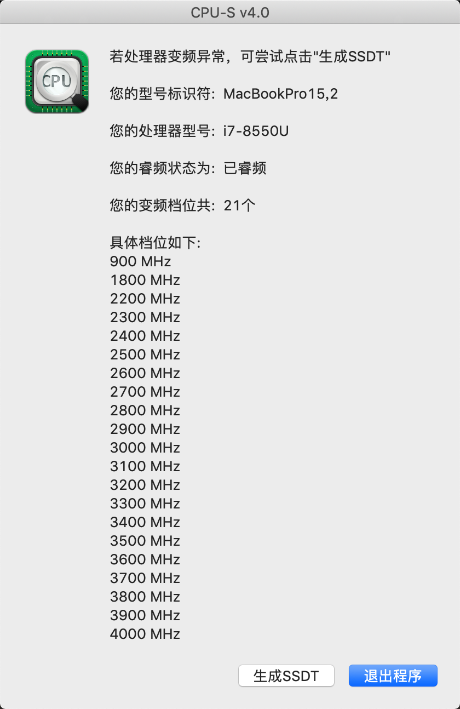

# Razer-Blade-Stealth-2018-Hackintosh (Mojave)
Hackintosh for Kaby Lake Refresh

* Originally installed on 10.14
* Tested with a Razer Blade Stealth 2019 i7 8550U / 16GB RAM

**Things to take note**

* Wifi will not work natively, it will require a USB dongle or a new card to be installed. I bought a `Broadcom BCM94352Z DW1560 802.11ac Wifi Bluetooth 4.0 M.2` from eBay, opened up the laptop and replaced the existing card with the Intel one. After that change, both wifi and Bluetooth work fine, for a cost of about $30.

* SSD works natively, it's a samsung 960 series SSD

**Things that should work fine**
	
* Intel UHD 620 Graphics
* Audio, including port switching
* Backlight
* Trackpad (including multi-touch gestures)
* Battery status
* CPU

* Sleep

**Things that have trouble working**
HMDI with 2.0 property